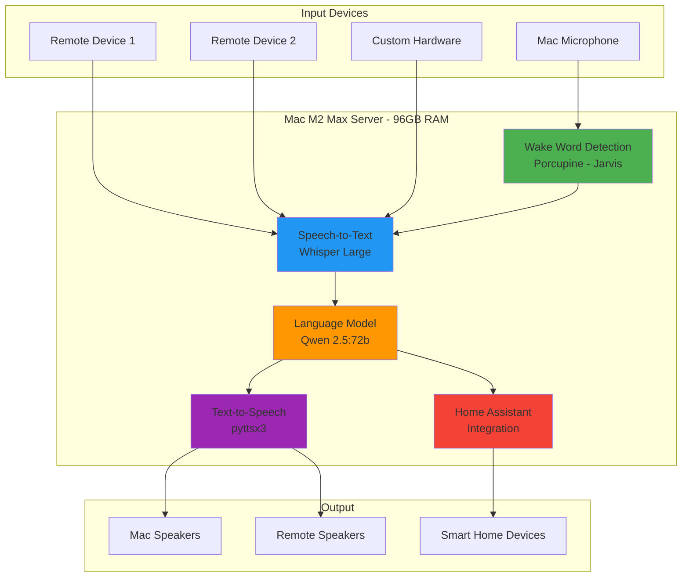
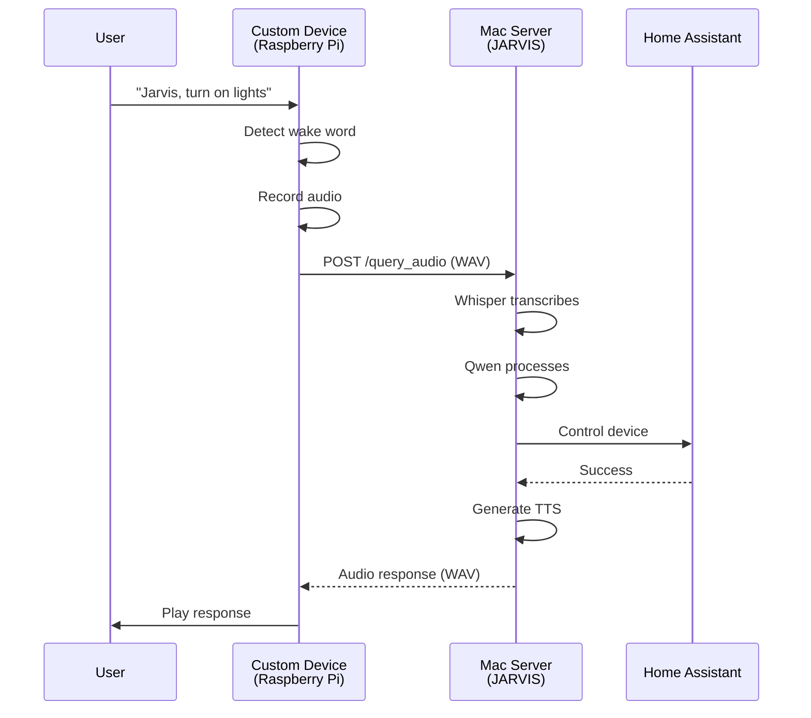
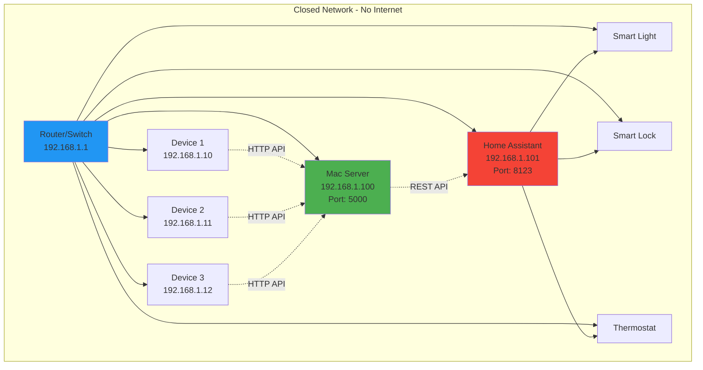

# JARVIS Voice Assistant - Complete Setup Guide

**Everything you need to rebuild this system from scratch after resetting your computer**

---

## Table of Contents
1. [System Overview](#system-overview)
2. [Hardware Requirements](#hardware-requirements)
3. [Software Installation](#software-installation)
4. [Voice Assistant Setup](#voice-assistant-setup)
5. [Home Assistant Integration](#home-assistant-integration)
6. [Custom Hardware Devices](#custom-hardware-devices)
7. [Network Configuration](#network-configuration)
8. [Troubleshooting](#troubleshooting)

---

## System Overview

This is a **100% offline, maximum intelligence voice assistant** that:
- Runs completely **without internet**
- Uses **Whisper Large** for speech recognition
- Uses **Qwen 2.5:72b** (one of the most intelligent open-source LLMs)
- Responds to wake word **"Jarvis"**
- Integrates with **Home Assistant** for smart home control
- Can be accessed by remote devices over your local network

### Architecture Diagram



---

## Hardware Requirements

### Server (Mac M2 Max)

**Required Specs:**
- **RAM**: 96 GB (for Qwen 2.5:72b)
- **Storage**: 60 GB free minimum
- **Processor**: M2 Max or equivalent
- **Network**: Ethernet or WiFi

**Your Current System:**
- ✅ Mac M2 Max, 96 GB RAM
- ✅ macOS Tahoe (Darwin 25.1.0)

### Custom Echo-Replacement Devices

#### Option 1: Raspberry Pi Based (Recommended)

**Parts List with Links:**

1. **Raspberry Pi 4 (4GB or 8GB)**
   - Link: https://www.raspberrypi.com/products/raspberry-pi-4-model-b/
   - Price: ~$55-75
   - Quantity: 1 per device

2. **USB Microphone Array (ReSpeaker)**
   - Link: https://www.seeedstudio.com/ReSpeaker-Mic-Array-v2-0.html
   - Price: ~$30
   - Features: 4-mic array, 360° voice pickup, far-field recognition

3. **Speaker**
   - Option A: USB Speaker
     - Link: https://www.amazon.com/AmazonBasics-Powered-Computer-Speakers-USB-Powered/dp/B00GHY5F3K
     - Price: ~$15
   - Option B: 3.5mm Speaker
     - Link: https://www.amazon.com/dp/B075M7FHM1
     - Price: ~$20

4. **Power Supply (USB-C, 15W)**
   - Link: https://www.raspberrypi.com/products/type-c-power-supply/
   - Price: ~$8

5. **MicroSD Card (32GB minimum)**
   - Link: https://www.amazon.com/SanDisk-Ultra-microSDHC-Memory-Adapter/dp/B08GY9NYRM
   - Price: ~$7

**Total Cost per Device: ~$135-155**

#### Option 2: ESP32 Based (Budget Option)

**Parts List:**

1. **ESP32-S3 DevKit**
   - Link: https://www.amazon.com/ESP32-S3-DevKitC-1-N8R2-Development-Bluetooth/dp/B0BKX4XZZK
   - Price: ~$15
   - Features: WiFi, Bluetooth, 8MB Flash

2. **INMP441 I2S Microphone**
   - Link: https://www.amazon.com/HiLetgo-INMP441-Omnidirectional-Interface-Precision/dp/B07JFHT2N4
   - Price: ~$8

3. **I2S Audio Amplifier (MAX98357A)**
   - Link: https://www.adafruit.com/product/3006
   - Price: ~$6

4. **Speaker (4Ω 3W)**
   - Link: https://www.adafruit.com/product/1314
   - Price: ~$2

5. **Power Supply (USB-C, 5V 2A)**
   - Link: https://www.amazon.com/Adapter-Charger-Samsung-Galaxy-Android/dp/B07G41NGQS
   - Price: ~$7

**Total Cost per Device: ~$38**

---

## Software Installation

### 1. Install Homebrew

```bash
/bin/bash -c "$(curl -fsSL https://raw.githubusercontent.com/Homebrew/install/HEAD/install.sh)"
```

### 2. Install Ollama

```bash
brew install ollama
```

### 3. Install System Dependencies

```bash
brew install portaudio ffmpeg
```

### 4. Install Python Dependencies

```bash
pip3 install openai-whisper pyaudio sounddevice scipy ollama flask pyttsx3 pvporcupine paho-mqtt requests
```

### 5. Download Qwen 2.5:72b Model

**⚠️ Important: This is a 47 GB download and will take 20-40 minutes**

```bash
ollama pull qwen2.5:72b
```

**Progress Monitoring:**
- The download will show progress in the terminal
- It will complete when you see "verifying sha256 digest" then "success"

### 6. Verify Installation

```bash
# Test Ollama
ollama list

# Test Whisper
python3 -c "import whisper; print('Whisper installed')"

# Test Wake Word
python3 -c "import pvporcupine; print('Porcupine installed')"

# Test ffmpeg
ffmpeg -version
```

---

## Voice Assistant Setup

### File Structure

```
~/Desktop/Jarvis-Voice-Assistant/
├── COMPLETE_SETUP_GUIDE.md          # This file
├── HARDWARE_GUIDE.md                 # Detailed hardware setup
├── NETWORK_SETUP.md                  # Network configuration
├── requirements.txt                  # Python dependencies
├── jarvis_with_wakeword.py          # Main JARVIS with wake word
├── jarvis_homeassistant.py          # JARVIS with Home Assistant
├── voice_assistant.py               # Basic voice assistant
├── voice_assistant_server.py        # API server for remote devices
├── test_client.py                   # Test client
└── README.md                        # Quick start guide
```

### Running JARVIS Locally

```bash
cd ~/Desktop/Jarvis-Voice-Assistant
python3 jarvis_with_wakeword.py
```

**Usage:**
1. Wait for "JARVIS is ready!"
2. Say **"Jarvis"**
3. Wait for beep/confirmation
4. Speak your command (5 seconds)
5. JARVIS will respond

### Running as API Server (for remote devices)

```bash
cd ~/Desktop/Jarvis-Voice-Assistant
python3 voice_assistant_server.py
```

**Server Details:**
- Runs on: `http://0.0.0.0:5000`
- Accessible from: Any device on your network
- Endpoints:
  - `GET /health` - Check server status
  - `POST /query` - Send audio, get text response
  - `POST /query_audio` - Send audio, get audio response
  - `POST /text_query` - Send text, get text response

---

## Home Assistant Integration

### 1. Install Home Assistant

**Option A: Raspberry Pi (Separate Device)**
- Link: https://www.home-assistant.io/installation/raspberrypi/
- Flash image to SD card
- Boot and configure

**Option B: Docker on Mac**

```bash
brew install docker
docker run -d \
  --name homeassistant \
  --privileged \
  --restart=unless-stopped \
  -e TZ=America/New_York \
  -v /Users/daniel/homeassistant:/config \
  --network=host \
  ghcr.io/home-assistant/home-assistant:stable
```

Access at: http://localhost:8123

### 2. Get Long-Lived Access Token

1. Open Home Assistant: http://localhost:8123
2. Click your profile (bottom left)
3. Scroll to "Long-Lived Access Tokens"
4. Click "Create Token"
5. Name it "JARVIS"
6. Copy the token

### 3. Configure JARVIS

Edit `jarvis_homeassistant.py`:

```python
HOME_ASSISTANT_URL = "http://192.168.1.100:8123"  # Your HA IP
HOME_ASSISTANT_TOKEN = "your_token_here"          # Paste token
```

### 4. Add Smart Devices to Home Assistant

Follow guides for your devices:
- **Philips Hue**: https://www.home-assistant.io/integrations/hue/
- **TP-Link Kasa**: https://www.home-assistant.io/integrations/tplink/
- **Zigbee Devices**: https://www.home-assistant.io/integrations/zha/
- **Z-Wave Devices**: https://www.home-assistant.io/integrations/zwave_js/

### Voice Commands

Once configured, you can say:
- "Jarvis, turn on the living room lights"
- "Jarvis, set the temperature to 72 degrees"
- "Jarvis, lock the front door"
- "Jarvis, close the garage door"

---

## Custom Hardware Devices

### System Flow Diagram



### Raspberry Pi Setup

**1. Flash Raspberry Pi OS**
- Download: https://www.raspberrypi.com/software/
- Flash to SD card
- Boot and connect to network

**2. Install Python Client**

```bash
# On Raspberry Pi
sudo apt-get update
sudo apt-get install python3-pyaudio python3-requests

# Create client script
nano jarvis_client.py
```

**3. Client Code** (see HARDWARE_GUIDE.md)

### ESP32 Setup

**1. Install Arduino IDE**
- Download: https://www.arduino.cc/en/software

**2. Install ESP32 Board**
- Add URL to Board Manager
- Install ESP32 boards

**3. Upload Code** (see HARDWARE_GUIDE.md)

---

## Network Configuration

### Network Diagram



### Static IP Configuration

**1. Mac Server**

System Settings → Network → WiFi/Ethernet → Details → TCP/IP:
- Configure IPv4: Manually
- IP Address: `192.168.1.100`
- Subnet Mask: `255.255.255.0`
- Router: `192.168.1.1`

**2. Home Assistant**

In Home Assistant:
Configuration → System → Network:
- Set static IP: `192.168.1.101`

**3. Custom Devices**

For Raspberry Pi:
```bash
sudo nano /etc/dhcpcd.conf
```

Add:
```
interface wlan0
static ip_address=192.168.1.10/24
static routers=192.168.1.1
static domain_name_servers=192.168.1.1
```

### Firewall Rules

**Mac Firewall:**
```bash
# Allow port 5000 for JARVIS API
# System Settings → Network → Firewall
# Add application: Python
```

---

## Troubleshooting

### Model Download Issues

**Problem**: Qwen download slow or fails
**Solution**:
```bash
# Check Ollama status
ollama list

# Restart download
ollama pull qwen2.5:72b

# Check available space
df -h
```

### Wake Word Not Working

**Problem**: "Jarvis" not detected
**Solution**:
```bash
# Test microphone
python3 -c "import sounddevice as sd; print(sd.query_devices())"

# Adjust sensitivity (in code)
self.porcupine = pvporcupine.create(
    keywords=['jarvis'],
    sensitivities=[0.7]  # 0.0-1.0, default 0.5
)
```

### Home Assistant Connection Failed

**Problem**: Cannot connect to HA
**Solution**:
1. Check HA is running: http://192.168.1.101:8123
2. Verify token is correct
3. Check firewall allows port 8123
4. Ping HA server: `ping 192.168.1.101`

### Audio Quality Issues

**Problem**: Choppy or distorted audio
**Solution**:
```bash
# Check sample rate
# Should be 16000 Hz

# Reduce latency
self.sample_rate = 16000
self.frame_length = 512  # Lower = less latency
```

---

## Backup & Restore

### Before Resetting Computer

**1. Backup This Folder**
```bash
# Copy to external drive
cp -r ~/Desktop/Jarvis-Voice-Assistant /Volumes/ExternalDrive/
```

**2. Export Ollama Models**
```bash
# Models are stored in ~/.ollama
cp -r ~/.ollama /Volumes/ExternalDrive/ollama-models/
```

**3. Save Configuration**
- Home Assistant token
- Network settings (IP addresses)
- Custom device configurations

### After Resetting Computer

**1. Restore Files**
```bash
cp -r /Volumes/ExternalDrive/Jarvis-Voice-Assistant ~/Desktop/
```

**2. Follow Software Installation** (see above)

**3. Restore Ollama Models** (optional - saves download time)
```bash
cp -r /Volumes/ExternalDrive/ollama-models ~/.ollama
```

**4. Verify Everything Works**
```bash
cd ~/Desktop/Jarvis-Voice-Assistant
python3 jarvis_with_wakeword.py
```

---

## Quick Reference Commands

```bash
# Start JARVIS with wake word
python3 ~/Desktop/Jarvis-Voice-Assistant/jarvis_with_wakeword.py

# Start JARVIS with Home Assistant
python3 ~/Desktop/Jarvis-Voice-Assistant/jarvis_homeassistant.py

# Start API server for remote devices
python3 ~/Desktop/Jarvis-Voice-Assistant/voice_assistant_server.py

# Test server health
curl http://localhost:5000/health

# Check Ollama models
ollama list

# View Ollama logs
tail -f ~/.ollama/logs/server.log

# Check Python packages
pip3 list | grep -E "whisper|ollama|pvporcupine"
```

---

## Additional Resources

**Official Documentation:**
- Whisper: https://github.com/openai/whisper
- Ollama: https://ollama.ai/
- Qwen: https://github.com/QwenLM/Qwen
- Porcupine: https://picovoice.ai/docs/porcupine/
- Home Assistant: https://www.home-assistant.io/docs/

**Community Support:**
- Ollama Discord: https://discord.gg/ollama
- Home Assistant Forum: https://community.home-assistant.io/
- Raspberry Pi Forums: https://forums.raspberrypi.com/

---

**Document Version**: 1.0
**Last Updated**: December 9, 2025
**System**: Mac M2 Max, 96GB RAM, macOS Tahoe
