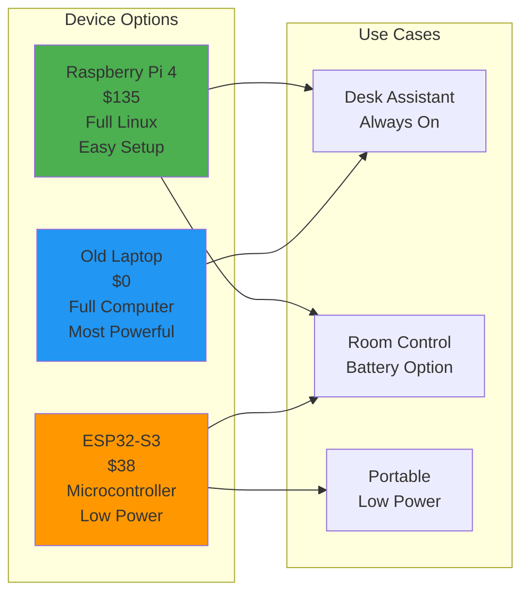
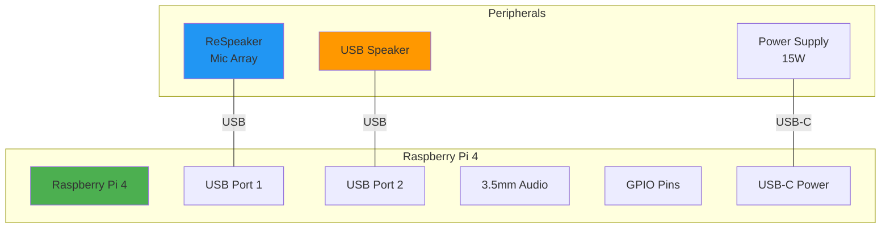
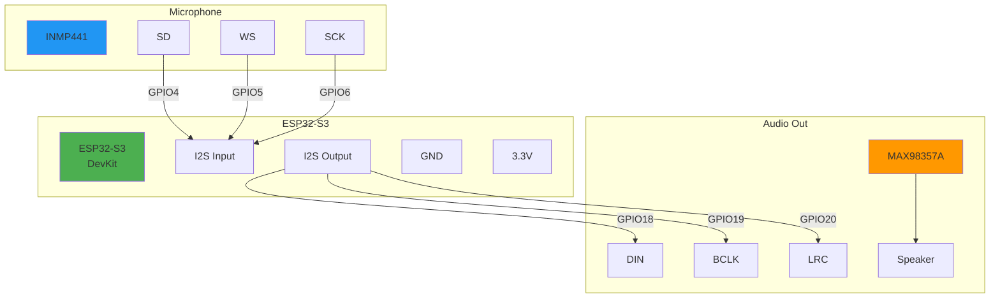

# JARVIS Hardware Setup Guide

Complete instructions for building custom voice-activated devices

---

## Hardware Options Comparison



---

## Option 1: Raspberry Pi 4 (Recommended)

### Why Choose This?
- ✅ Full Linux OS
- ✅ Easy Python development
- ✅ Great audio quality
- ✅ Lots of community support
- ✅ Can run locally or as client

### Complete Parts List

| Part | Link | Price | Notes |
|------|------|-------|-------|
| **Raspberry Pi 4 (4GB)** | [Buy Here](https://www.raspberrypi.com/products/raspberry-pi-4-model-b/) | $55 | 4GB minimum, 8GB recommended |
| **ReSpeaker 4-Mic Array** | [Buy Here](https://www.seeedstudio.com/ReSpeaker-Mic-Array-v2-0.html) | $30 | Best option for voice |
| **USB Speaker** | [Buy Here](https://www.amazon.com/AmazonBasics-Powered-Computer-Speakers-USB-Powered/dp/B00GHY5F3K) | $15 | USB powered |
| **Power Supply (USB-C 15W)** | [Buy Here](https://www.raspberrypi.com/products/type-c-power-supply/) | $8 | Official PSU |
| **MicroSD Card (64GB)** | [Buy Here](https://www.amazon.com/SanDisk-Ultra-microSDXC-Memory-Adapter/dp/B0B7NTY2S6) | $9 | Class 10 minimum |
| **Case** | [Buy Here](https://www.amazon.com/Raspberry-Pi-Case-Black-Gray/dp/B07WG4DW52) | $8 | Optional but recommended |

**Total: ~$125**

### Wiring Diagram



### Setup Instructions

**1. Flash Raspberry Pi OS**

```bash
# Download Raspberry Pi Imager
# From: https://www.raspberrypi.com/software/

# Flash Raspberry Pi OS Lite (64-bit)
# Enable SSH and WiFi in imager settings
```

**2. Initial Boot**

```bash
# SSH into Pi (find IP from router)
ssh pi@192.168.1.10  # Default password: raspberry

# Update system
sudo apt-get update
sudo apt-get upgrade -y

# Install dependencies
sudo apt-get install -y python3-pip python3-pyaudio portaudio19-dev
```

**3. Install Python Client**

```bash
# Install Python packages
pip3 install requests sounddevice scipy numpy

# Create client script
nano jarvis_client.py
```

**4. Client Code**

```python
#!/usr/bin/env python3
"""
JARVIS Client for Raspberry Pi
Records audio and sends to server
"""

import sounddevice as sd
import numpy as np
from scipy.io import wavfile
import requests
import tempfile
import os
import time

# Configuration
SERVER_URL = "http://192.168.1.100:5000"  # Your Mac's IP
SAMPLE_RATE = 16000
DURATION = 5  # seconds

def detect_wake_word():
    """Simple energy-based wake word detection"""
    print("Listening for wake word...")

    while True:
        # Record short clip
        audio = sd.rec(
            int(0.5 * SAMPLE_RATE),
            samplerate=SAMPLE_RATE,
            channels=1,
            dtype=np.float32
        )
        sd.wait()

        # Check if loud enough (simple threshold)
        if np.abs(audio).mean() > 0.02:
            print("Wake word detected!")
            return True

        time.sleep(0.1)

def record_command():
    """Record audio command"""
    print(f"Recording for {DURATION} seconds...")

    audio = sd.rec(
        int(DURATION * SAMPLE_RATE),
        samplerate=SAMPLE_RATE,
        channels=1,
        dtype=np.float32
    )
    sd.wait()

    return audio.flatten()

def send_to_server(audio):
    """Send audio to JARVIS server"""
    # Save to temporary file
    with tempfile.NamedTemporaryFile(suffix=".wav", delete=False) as f:
        temp_path = f.name
        wavfile.write(temp_path, SAMPLE_RATE, (audio * 32767).astype(np.int16))

    # Send to server
    with open(temp_path, 'rb') as f:
        files = {'audio': f}
        response = requests.post(
            f"{SERVER_URL}/query_audio",
            files=files,
            timeout=30
        )

    os.unlink(temp_path)

    if response.status_code == 200:
        # Save response audio
        with tempfile.NamedTemporaryFile(suffix=".wav", delete=False) as f:
            response_path = f.name
            f.write(response.content)

        return response_path
    else:
        print(f"Error: {response.status_code}")
        return None

def play_response(audio_path):
    """Play audio response"""
    # Read audio file
    sample_rate, audio = wavfile.read(audio_path)

    # Play
    sd.play(audio, sample_rate)
    sd.wait()

    os.unlink(audio_path)

def main():
    """Main loop"""
    print("JARVIS Client Started")
    print(f"Server: {SERVER_URL}")

    while True:
        try:
            # Wait for wake word
            detect_wake_word()

            # Record command
            audio = record_command()

            # Send to server
            response_path = send_to_server(audio)

            if response_path:
                # Play response
                play_response(response_path)

            print("\nReady for next command...\n")

        except KeyboardInterrupt:
            print("\nShutting down...")
            break
        except Exception as e:
            print(f"Error: {e}")
            time.sleep(1)

if __name__ == "__main__":
    main()
```

**5. Auto-Start on Boot**

```bash
# Create systemd service
sudo nano /etc/systemd/system/jarvis-client.service
```

Add:
```ini
[Unit]
Description=JARVIS Client
After=network.target

[Service]
ExecStart=/usr/bin/python3 /home/pi/jarvis_client.py
WorkingDirectory=/home/pi
StandardOutput=inherit
StandardError=inherit
Restart=always
User=pi

[Install]
WantedBy=multi-user.target
```

Enable:
```bash
sudo systemctl enable jarvis-client.service
sudo systemctl start jarvis-client.service
```

---

## Option 2: ESP32-S3 (Budget/Low Power)

### Why Choose This?
- ✅ Very cheap ($15)
- ✅ Low power consumption
- ✅ WiFi built-in
- ✅ Can run on battery
- ⚠️ Requires Arduino programming

### Complete Parts List

| Part | Link | Price | Notes |
|------|------|-------|-------|
| **ESP32-S3 DevKit** | [Buy Here](https://www.amazon.com/ESP32-S3-DevKitC-1-N8R2/dp/B0BKX4XZZK) | $15 | 8MB Flash |
| **INMP441 Microphone** | [Buy Here](https://www.amazon.com/HiLetgo-INMP441-Omnidirectional/dp/B07JFHT2N4) | $8 | I2S digital mic |
| **MAX98357A Amplifier** | [Buy Here](https://www.adafruit.com/product/3006) | $6 | I2S amplifier |
| **Speaker (4Ω 3W)** | [Buy Here](https://www.adafruit.com/product/1314) | $2 | Small speaker |
| **Breadboard & Wires** | [Buy Here](https://www.amazon.com/dp/B082KBF7MM) | $7 | For prototyping |

**Total: ~$38**

### Wiring Diagram



### Pin Connections

| ESP32-S3 Pin | INMP441 Mic | MAX98357A Amp |
|--------------|-------------|---------------|
| GPIO4        | SD          | -             |
| GPIO5        | WS          | -             |
| GPIO6        | SCK         | -             |
| GPIO18       | -           | DIN           |
| GPIO19       | -           | BCLK          |
| GPIO20       | -           | LRC           |
| 3.3V         | VDD         | VIN           |
| GND          | GND         | GND           |

### Arduino Code

```cpp
#include <WiFi.h>
#include <HTTPClient.h>
#include <driver/i2s.h>

// WiFi credentials
const char* ssid = "YourNetworkName";
const char* password = "YourPassword";

// Server URL
const char* serverURL = "http://192.168.1.100:5000/query_audio";

// I2S pins
#define I2S_WS 5
#define I2S_SD 4
#define I2S_SCK 6

// Sample rate
#define SAMPLE_RATE 16000
#define DURATION 5  // seconds

void setup() {
    Serial.begin(115200);

    // Connect to WiFi
    WiFi.begin(ssid, password);
    while (WiFi.status() != WL_CONNECTED) {
        delay(500);
        Serial.print(".");
    }
    Serial.println("\nWiFi connected");

    // Configure I2S for microphone
    i2s_config_t i2s_config = {
        .mode = (i2s_mode_t)(I2S_MODE_MASTER | I2S_MODE_RX),
        .sample_rate = SAMPLE_RATE,
        .bits_per_sample = I2S_BITS_PER_SAMPLE_32BIT,
        .channel_format = I2S_CHANNEL_FMT_ONLY_LEFT,
        .communication_format = I2S_COMM_FORMAT_I2S,
        .intr_alloc_flags = ESP_INTR_FLAG_LEVEL1,
        .dma_buf_count = 8,
        .dma_buf_len = 64
    };

    i2s_pin_config_t pin_config = {
        .bck_io_num = I2S_SCK,
        .ws_io_num = I2S_WS,
        .data_out_num = I2S_PIN_NO_CHANGE,
        .data_in_num = I2S_SD
    };

    i2s_driver_install(I2S_NUM_0, &i2s_config, 0, NULL);
    i2s_set_pin(I2S_NUM_0, &pin_config);

    Serial.println("JARVIS Client Ready");
}

void loop() {
    Serial.println("Say something...");
    delay(2000);

    // Record audio
    int samples = SAMPLE_RATE * DURATION;
    int32_t* buffer = (int32_t*)malloc(samples * sizeof(int32_t));

    size_t bytes_read = 0;
    i2s_read(I2S_NUM_0, buffer, samples * sizeof(int32_t), &bytes_read, portMAX_DELAY);

    // Convert to 16-bit
    int16_t* audio16 = (int16_t*)malloc(samples * sizeof(int16_t));
    for (int i = 0; i < samples; i++) {
        audio16[i] = buffer[i] >> 16;
    }

    // Send to server
    if (WiFi.status() == WL_CONNECTED) {
        HTTPClient http;
        http.begin(serverURL);
        http.addHeader("Content-Type", "audio/wav");

        // Create WAV header (simplified)
        uint8_t wavHeader[44];
        // ... WAV header creation code ...

        // Send request
        int httpCode = http.POST(audio16, samples * sizeof(int16_t));

        if (httpCode == 200) {
            Serial.println("Response received");
            // Play audio response
            // ... playback code ...
        }

        http.end();
    }

    free(buffer);
    free(audio16);

    delay(1000);
}
```

---

## Option 3: Old Laptop/Desktop

### Why Choose This?
- ✅ Free (if you have one)
- ✅ Most powerful
- ✅ Great for desk setup
- ✅ Can run full Linux

### Setup

1. Install Ubuntu/Debian
2. Follow Raspberry Pi setup instructions
3. Connect USB microphone and speaker
4. Run client script

---

## Power Consumption Comparison

| Device | Idle Power | Active Power | Daily Cost (24/7) |
|--------|------------|--------------|-------------------|
| Raspberry Pi 4 | 2.7W | 6.4W | $0.08/day |
| ESP32-S3 | 0.1W | 0.5W | $0.01/day |
| Old Laptop | 15W | 45W | $0.43/day |

---

## Enclosure Options

### 3D Printed Case
- Design files: https://www.thingiverse.com/thing:4829652
- Material: PLA or PETG
- Cost: ~$3-5 in filament

### Commercial Case
- Link: https://www.amazon.com/GeeekPi-Raspberry-Aluminum-Heatsinks-Raspberry/dp/B07VD568FB
- Price: ~$12

### DIY Wooden Case
- Materials: Small wooden box, drill
- Cost: ~$5-10

---

## Testing Checklist

- [ ] Device powers on
- [ ] WiFi connects
- [ ] Microphone records audio
- [ ] Speaker plays audio
- [ ] Can ping server (192.168.1.100)
- [ ] Audio sent to server successfully
- [ ] Response received and played
- [ ] Wake word detection works
- [ ] Auto-starts on boot

---

## Troubleshooting

### No Audio Recording
```bash
# Test microphone
arecord -l  # List devices
arecord -D hw:1,0 -d 5 test.wav  # Test recording
aplay test.wav  # Test playback
```

### WiFi Not Connecting
```bash
# Check WiFi status
iwconfig

# Scan networks
sudo iwlist wlan0 scan

# Restart networking
sudo systemctl restart networking
```

### Server Not Reachable
```bash
# Test connectivity
ping 192.168.1.100

# Test HTTP
curl http://192.168.1.100:5000/health
```

---

**Next Steps**: See [COMPLETE_SETUP_GUIDE.md](COMPLETE_SETUP_GUIDE.md) for software configuration
